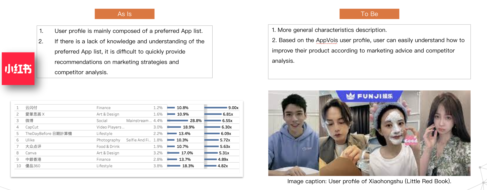
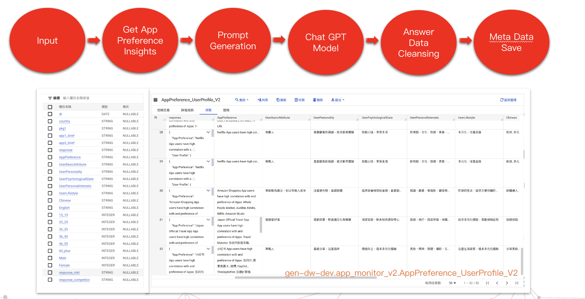
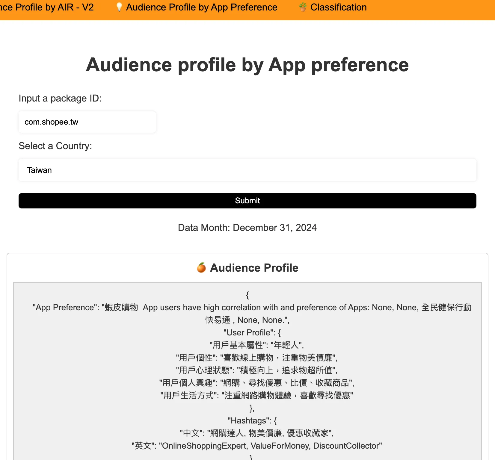
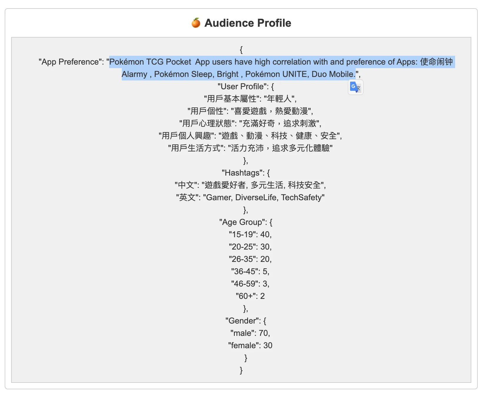
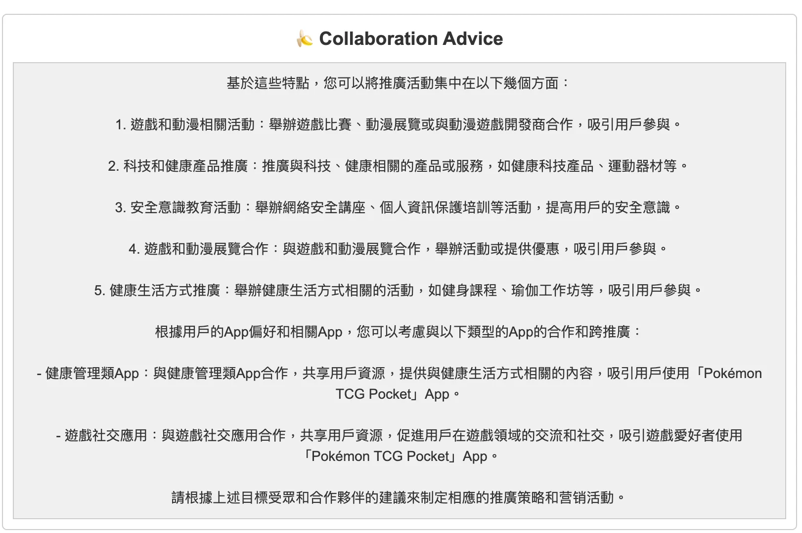
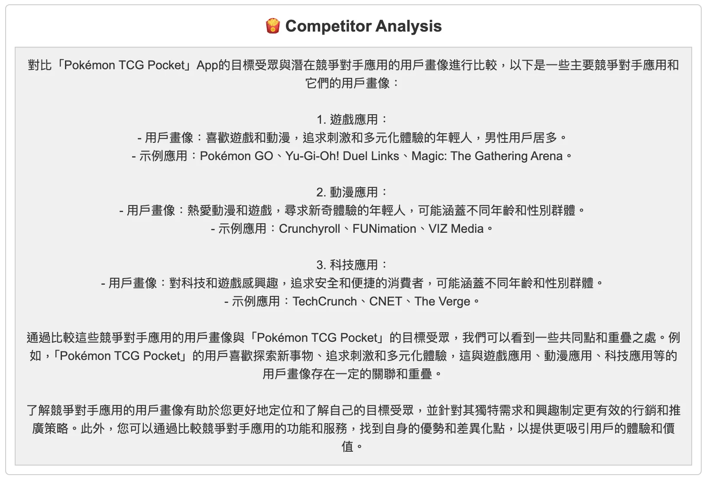
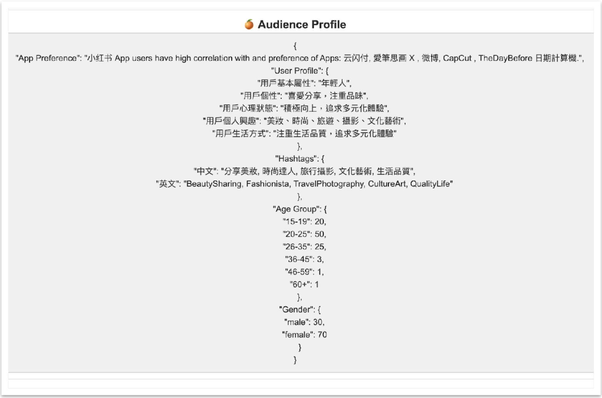
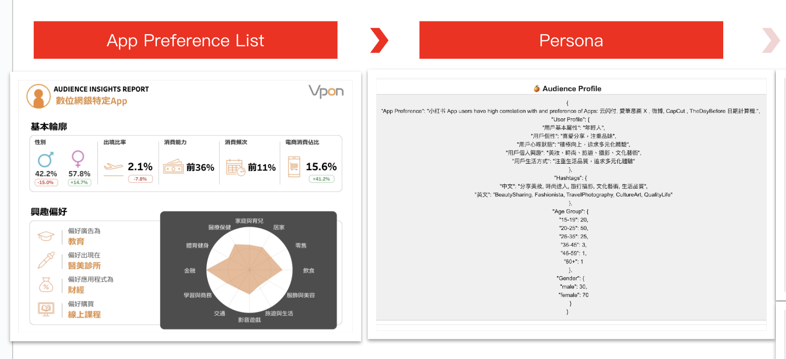

# Work Project Highlights

## 1. LLM-Powered Audience Persona Generator
**LLM-Powered Audience Insights**  
用大型語言模型產出受眾Persona

### 3. Problem Statement  
App用戶偏好App清單不夠直觀（不是每個App大家都知道是做什麼的，業務常常會來問）



### 4. Solution Overview  
- 核心做法: 結合使用者行為資料與LLM生成受眾描述）  
- 技術架構圖

- 流程步驟：  
  1. 資料收集（每個App安裝用戶的偏好App清單）  
  2. Prompt 設計與 LLM 呼叫（例如：如何把用戶行為轉成 prompt）  
  4. 生成 & 後處理（例如：從 LLM output 做標籤歸類:基本屬性,個性,心理狀態,個人興趣,生活方式）  
  4. POC結果呈現（Flask）






### 5. Tech Stack  
- 語言／工具：Python (openAI), BigQuery, Flask 
- LLM／模型：OpenAI gpt-3.5-turbo


### 6. Impact  
1. 將陌生的App清單轉化為具象的Persona
2. 並提取族群標籤



### 7. Challenges & How You Overcame Them  
- LLM output 不穩定 → prompt engineering：透過設計persona回答格式、給予參考範本，與參數(temperature等)設定，來避免回答發散和不穩定。


### 8. Lessons Learned / Takeaways  
- 你從這個專案學到什麼：prompt engineering要給定明確答案規格和範例，讓結果更穩定不發散。  
- 如果再做一次會怎麼改進：可以把偏好的清單的score一起加入input。 
- 建立一個可重用的模組、可擴展的設計：有把此應用套用到其他受眾輪廓，產出不同的分析洞察。
- 搭建好可重複使用text prompt input的pipeline：其他應用包括poi分類器、發票中文分類標籤翻譯器等。



### 9. Demo (Flask)


--- 

### Appendix

[github repo](https://github.com/hsuanlion/AudienceProfile-by-chatGPT/tree/main/app)

openAI

```
def get_completion(prompt, model="gpt-3.5-turbo"):
    messages = [{"role": "user", "content": prompt}]
    response = openai.ChatCompletion.create(
        model=model,
        messages=messages,
        temperature=0, # this is the degree of randomness of the model's output
    )
    return response.choices[0].message["content"]
  ```

prompt設計

```
prompt = f"""
    Step 1:
    Base on following user App preferencce, which is delimited with triple backticks, generate user profile about their basic profile, personality, mental state, interest and lifestyle:
    Use no more than 5 sentences. Use Chinese.
    Separate each sentence with bullet point.
    Provide answer in JSON format with following keys:
    用戶基本屬性,用戶個性,用戶心理狀態,用戶個人興趣,用戶生活方式

    Step 2:
    Give the user group 2~3 lifestyle characteristic hashtags. Separate using comma. Use Chinese & English.
    Provide answer in JSON format with following keys:
    Chinese, English

    Step 3:
    Base on following user App preferencce, which is delimited with triple backticks, give estimated percentage distribution of the age group, which added up to 100.
    List of age group: {", ".join(age_group_list)}
    Provide answer in JSON format with {age_group_list} as keys.

    Step 4:
    Base on following user App preferencce, which is delimited with triple backticks, give estimated percentage distribution of the gender, which added up to 100.
    List of gender: {", ".join(gender_list)}
    Provide answer in JSON format with {gender_list} as keys.


    User App preference: '''{AppPreference}'''


    # Provide {AppPreference} description text along with above 4 steps answers in JSON format with the following keys:
    App Preference, User Profile, Hashtags, Age Group, Gender.
    Final format example:
    ```{{
        "App Preference": "Spotify App users have high correlation with and preference of Apps: Microsoft 365, PlayStation App, Deliveroo 戶戶送, AVG Protection, The Club.",
        "User Profile": {{
            "用戶基本屬性": "年輕人",
            "用戶個性": "喜愛音樂，注重品味",
            "用戶心理狀態": "積極向上，追求快樂",
            "用戶個人興趣": "音樂、遊戲、美食、保護電腦、社交活動"
            "用戶生活方式": "熱愛生活，追求多元化體驗"
        }},
        "Hashtags": {{
            "中文": "音樂愛好者, 多元生活, 品味保護",
            "英文": "MusicLover, DiverseLife, TasteProtection"
        }},
        "Age Group": {{
            "15-19": 30,
            "20-25": 40,
            "26-35": 20,
            "36-45": 5,
            "46-59": 3,
            "60+": 2
        }},
        "Gender": {{
            "male": 60,
            "female": 40
        }}
    }}```
    """
```


### Links  
- GitHub Repo: [AudienceProfile-by-chatGPT](https://github.com/hsuanlion/AudienceProfile-by-chatGPT/tree/main/app)  