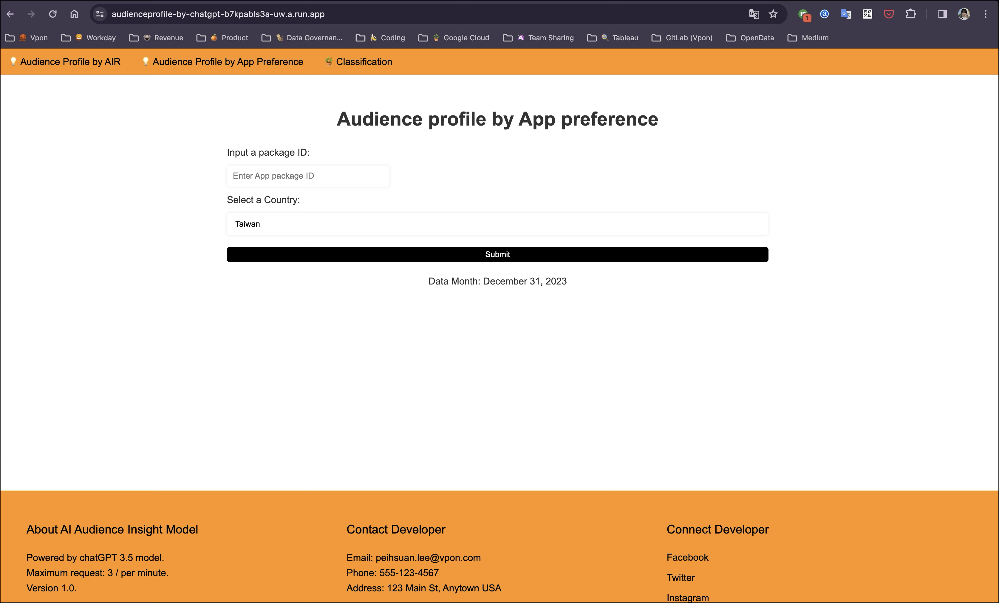
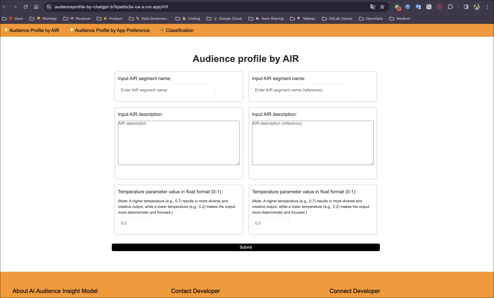

# LLM-Powered Audience Persona
*用大型語言模型＋行為資料，自動生成具象化受眾 Persona 與族群標籤，並提出next actions。*

## 1. Summary  
將原本難以解讀的 App 偏好清單，轉成可理解的「受眾 Persona」（包含基本屬性、個性、心理狀態、興趣與生活方式）與 hashtag 特色，以及年齡／性別估計分布，和進階的合作和競業分析，供業務與產品快速抓取群體洞察。

## 2. Role & Responsibilities  
- Owner of the LLM application design and proof-of-concept 
- 設計資料 pipeline（偏好清單收集與清洗）  
- Prompt engineering for LLM （Lead data scientist understanding prompt engineering)
- 架構 LLM output 後處理與標籤化 (pipeline automation) 
- 建立 Flask-built demo site 供POC內部驗證與展示

## 3. Problem Statement  
業務收到的 App 偏好清單只是「App 名單」，許多客戶或內部成員不熟悉這些 App 的意義，難以直觀理解某群體的特性。  
業務常詢問：這些用戶到底是什麼樣的人？偏好安裝清單中的XYZ App是什麼？合理的嗎？ 我們可以提供哪些服務給App publisher呢？
 <!-- alt: 轉換後的受眾 persona 範例 -->

## 4. Solution Overview  
- **核心做法：** 結合使用者行為（App 偏好清單）與大型語言模型，自動產出多維度 persona 與群體標籤。  
- **資料處理流程圖：**  
   <!-- alt: 技術架構圖，顯示資料流與 LLM 呼叫流程 -->

- **資料處理流程步驟說明：**  
  1. 資料收集：蒐集每個 App 安裝用戶的偏好 App 清單（來源、清洗）。  
  2. Prompt 設計與 LLM 呼叫：將行為資料轉換成結構化 prompt，呼叫 OpenAI GPT 模型。  
  3. 生成與後處理：解析 LLM output，做標籤分類（基本屬性、個性、心理狀態、興趣、生活方式），以及產出對應行銷建議（合作與競業分析）。  
  4. 結果呈現：將POC結果用 Flask-built demo site展示。  

- **POC成果展現：**  
<div style="display:grid;grid-template-columns:repeat(2,1fr);gap:1rem;margin:1rem 0;">
  <div>
    
    <div style="font-size:0.8rem;margin-top:4px;color:#555;">Demo site的Input和Output</div>
  </div>
  <div>
    
    <div style="font-size:0.8rem;margin-top:4px;color:#555;">LLM output & persona framework</div>
  </div>
  <div>
    
    <div style="font-size:0.8rem;margin-top:4px;color:#555;">合作建議</div>
  </div>
  <div>
    
    <div style="font-size:0.8rem;margin-top:4px;color:#555;">競爭者分析</div>
  </div>
</div>

## 5. Tech Stack  
- **Languages / Tools:** Python (OpenAI), BigQuery, Flask  
- **LLM / Model:** OpenAI `gpt-3.5-turbo`  

## 6. Impact  
- 將原本難以解讀的 App 偏好清單，轉換為具象化的 Persona 與族群標籤和行銷建議(合作與競爭分析），提升業務與產品理解速度，並提供next action。
- 可擴展的 prompt pipeline，可重用的 prompt template（用於其他應用如 POI 分類、中文分類標籤翻譯、與其他分析報告自動化摘要）
- 與團隊分享LLM prompt engineering的經驗，包括使用方式、不同參數和prompt效果比較，幫助同仁可以設計自己想要的指令與結果。

## 7. Challenges & Solutions  
- **LLM output 不穩定／發散：**  
  解法：設計明確格式的 prompt template，提供範例回答（few-shot style）、固定結構（JSON keys）（當時還沒有output為json參數可以設定）、調整參數（如 temperature=0 以降低隨機性）。  
- **LLM 指令理解程度優化：**
  解法：比較使用中文、英文的成果（發現英文較佳）。並使用技巧如(1) backticks區隔資訊，(2)step by step將任務拆解成數個步驟，以確保執行上有固定SOP，(3)提供example。
- **當資訊有限時會產生重複或較不相關的字眼**
  解法：使用top_p（控制相關度）、presence penalty & frequency penalty（控制字眼豐富度）。

## 8. Lessons Learned / Takeaways  
- **學到的事：** 明確且有範例的 prompt 能顯著提升輸出一致性與可用性。  
- **再做一次會改進：** 把每個偏好 App 的 score / weighting 一併納入 prompt input，提高 persona 精準度。  
- **可重用性：** 這套 LLM 自動化pipeline 已套用到其他受眾輪廓分析、和 POI分類器、中文標籤翻譯器等應用。  
- **模組化設計：** 建立 reusable text-prompt input pipeline，降低新 case 的上手成本。  

其他應用
 <!-- alt: 可重用 prompt pipeline 示意 -->
poi classification


## 9. Demo Site Snapshot
Flask-based proof-of-concept 展示 persona 生成結果與可互動的群體輪廓視覺化。  
 <!-- alt: Flask demo dashboard -->
 <!-- alt: Flask demo dashboard -->

---

## Appendix

### Code Snippet: Chat Completion Helper
```python
def get_completion(prompt, model="gpt-3.5-turbo"):
    messages = [{"role": "user", "content": prompt}]
    response = openai.ChatCompletion.create(
        model=model,
        messages=messages,
        temperature=0,  # 控制隨機性：0 表示最穩定
    )
    return response.choices[0].message["content"]
```

### Prompt Design （中譯整理版)
```text
Step 1:
根據下面由三個反引號包住的用戶 App 偏好清單，生成用戶輪廓，包括：用戶基本屬性、個性、心理狀態、個人興趣、生活方式。
- 不超過 5 句話。
- 使用中文，每句用 bullet point 分開。
- 回傳 JSON 格式，keys: 用戶基本屬性, 用戶個性, 用戶心理狀態, 用戶個人興趣, 用戶生活方式

Step 2:
為該用戶群擬出 2~3 個生活型態特色 hashtag，中文與英文各一組，用逗號分隔。
- 回傳 JSON 格式，keys: Chinese, English

Step 3:
根據同樣的 App 偏好清單，估計年齡層分布（加總為 100%）。
- 年齡群列表：{", ".join(age_group_list)}
- 回傳 JSON，keys 為各年齡群

Step 4:
根據 App 偏好清單，估計性別分布（加總為 100%）。
- 性別列表：{", ".join(gender_list)}
- 回傳 JSON，keys 為各性別

User App preference: {AppPreference}

最後，把以上結果整合成一個 JSON 物件，格式如下範例：

```json
{
  "App Preference": "...",
  "User Profile": {
    "用戶基本屬性": "...",
    "用戶個性": "...",
    "用戶心理狀態": "...",
    "用戶個人興趣": "...",
    "用戶生活方式": "..."
  },
  "Hashtags": {
    "Chinese": "...",
    "English": "..."
  },
  "Age Group": {
    "15-19": 30,
    "20-25": 40,
    ...
  },
  "Gender": {
    "male": 60,
    "female": 40
  }
}
```

